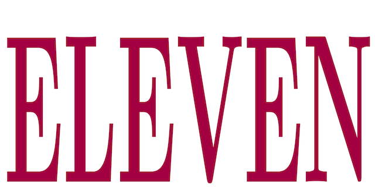
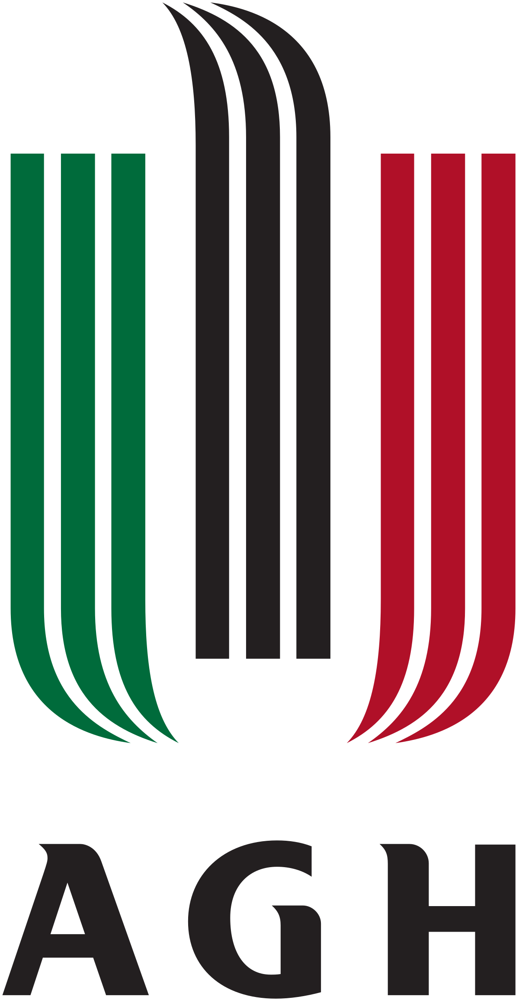

**ELEVEN - Elevator Brake Optimization and UQ** is an easy-to-run code for robust optimization and uncertainty quantification of an elevator brake system. The implementation follows an educational style, to make its use very intuitive.

## Software History

This code was developed to conduct numerical simulations related to the robust optimization and uncertainty quantification of an elevator brake system. The underlying results are reported in the following paper:
- *P. Wolszczak, P. Lonkwic, A. Cunha Jr, G. Litak, and S. Molski, Robust optimization and uncertainty quantification in the nonlinear mechanics of an elevator brake system, Meccanica, v. 54, pp. 1057-1069, 2019 https://doi.org/10.1007/s11012-019-00992-7*

## Documentation

**ELEVEN** routines are commented in order to explain their functionality to the final user. Each routine has a short description about its purpose, and a list of inputs and/or outputs.

## Authors
- Piotr Wolszczak
- Pawel Lonkwic
- Americo Cunha Jr
- Grzegorz Litak 
- Szymon Molski

## Citing ELEVEN

We kindly ask users to cite the following reference in any publications reporting work done with **ELEVEN**:
- *P. Wolszczak, P. Lonkwic, A. Cunha Jr, G. Litak, and S. Molski, Robust optimization and uncertainty quantification in the nonlinear mechanics of an elevator brake system, Meccanica, v. 54, pp. 1057-1069, 2019 https://doi.org/10.1007/s11012-019-00992-7*

```
@article{Wolszczak2019p1057,
   author  = {P. Wolszczak and P. Lonkwic and A. {Cunha~Jr} and G. Litak and S. Molski},
   title   = {Robust optimization and uncertainty quantification in the nonlinear mechanics of an elevator brake system},
   journal = {Meccanica},
   year    = {2019},
   volume  = {54},
   pages   = {1057-1069},
   doi     = {https://doi.org/10.1007/s11012-019-00992-7},
}
```

## License

**ELEVEN** is released under the MIT license. See the LICENSE file for details. All new contributions must be made under the MIT license.

 

## Institutional support

 &nbsp; &nbsp;  &nbsp; &nbsp; 

## Funding

 &nbsp; &nbsp;  &nbsp; &nbsp; 
